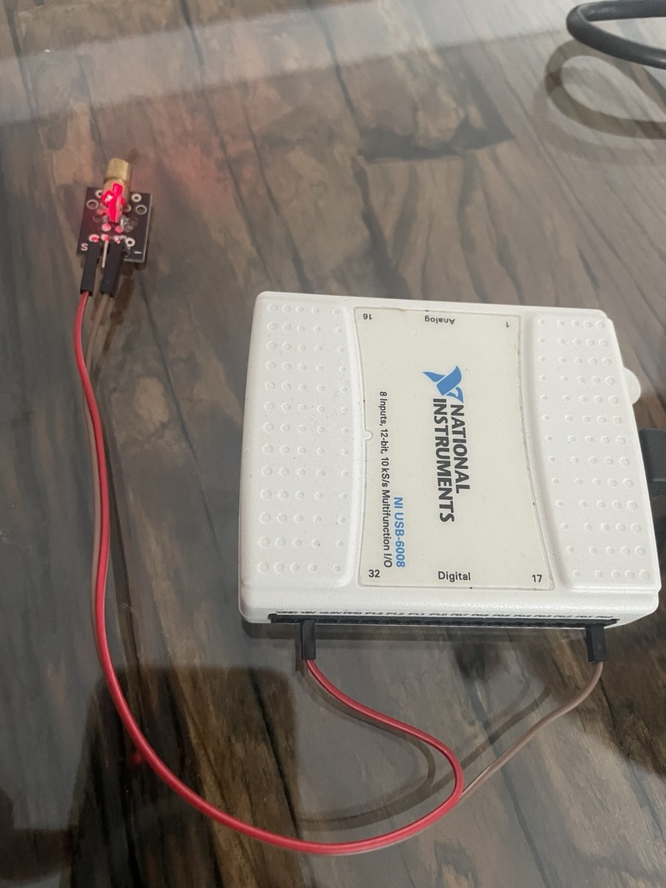
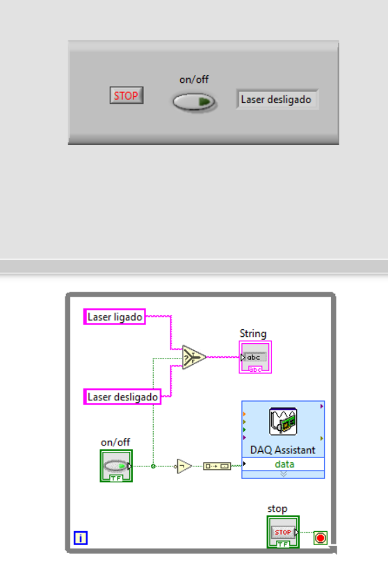

# laser-daq
Controle de Laser com DAQ em LabVIEW

# Controle de Laser com DAQ em LabVIEW

Este projeto em **LabVIEW** implementa um controle digital simples para ligar e desligar um sistema de **laser** por meio de uma interface gráfica de usuário (GUI) integrada a uma placa de aquisição de dados (**DAQ Assistant**), com feedback visual em tempo real e controle de segurança por botão de parada de emergência.

Este projeto foi desenvolvido em LabVIEW 2020 utilizando VI's para controle de laser com DAQ (acquisition device).

##  Funcionalidade

A aplicação permite:

- **Acionar um laser** (ligar/desligar) por meio de um botão **on/off**.
- **Exibir o status do laser** em tempo real através de uma string indicativa (`Laser ligado` / `Laser desligado`).
- **Controlar a saída digital** de uma placa de aquisição de dados (DAQ) usando o **DAQ Assistant**.
- **Encerrar a execução com segurança** por meio de um botão de **STOP** dedicado.

##  Interface do Usuário (Front Panel)

A interface gráfica inclui:

- Um botão do tipo **toggle switch** rotulado como `on/off`.
- Indicador de texto (`String`) exibindo o estado do laser.
- Botão de emergência (`STOP`) para interromper imediatamente o programa.

##  Diagrama de Bloco (Block Diagram)

O código LabVIEW está estruturado da seguinte forma:

1. **Controle de Estado:**
   - Um botão booleano (`on/off`) determina se o laser está ligado ou desligado.
   - A saída booleana é conectada a uma estrutura `Select`, que alterna entre os textos `"Laser ligado"` e `"Laser desligado"`.

2. **Saída DAQ:**
   - O sinal booleano é convertido em um valor numérico (`0` ou `1`) usando o bloco `Boolean to (0,1)`.
   - Este valor é enviado à **DAQ Assistant**, configurada para uma saída digital, ativando ou desativando fisicamente o laser.

3. **Parada Segura:**
   - Um botão `STOP` encerra o loop `While`, finalizando a execução do VI com segurança.

##  Pré-requisitos

- **LabVIEW** (versão recomendada: 2020 ou superior)
- **DAQ Assistant instalado**
- **Placa DAQ compatível com controle digital** (ex: NI USB-6009, NI myDAQ, etc.)
- **Driver NI-DAQmx** instalado e configurado
- Dispositivo **laser com entrada digital** (5V ou 3.3V, conforme sua DAQ)

##  Como usar

1. Conecte seu dispositivo laser à saída digital configurada na sua DAQ.
2. Abra o arquivo `.vi` no LabVIEW.
3. Execute o VI.
4. Use o botão `on/off` para ligar ou desligar o laser.
5. O status textual será atualizado automaticamente.
6. Pressione `STOP` para encerrar o programa.

##  Segurança

- Certifique-se de que o laser esteja **apontado para uma área segura** antes de ativar.
- Use **óculos de proteção adequados**.
- Não exponha seres vivos diretamente ao feixe.
- Em caso de emergência, utilize o botão `STOP`.

##  Referências

- National Instruments. [Getting Started with DAQ in LabVIEW](https://www.ni.com/en-us/support/documentation/supplemental/06/getting-started-with-labview-and-daqmx.html)
- NI-DAQmx Help Documentation (disponível no NI MAX)

  
You can reach me at rmilhomem[at]gmail[dot]com or connect on [LinkedIn](https://www.linkedin.com/in/rodolfo-space-force/) for collaborations.

## Licença

Este projeto está licenciado sob a Licença MIT. Você pode usar, modificar e redistribuir este código livremente, desde que mencione o autor original.

[Clique aqui para ver a licença completa.](https://opensource.org/licenses/MIT)

